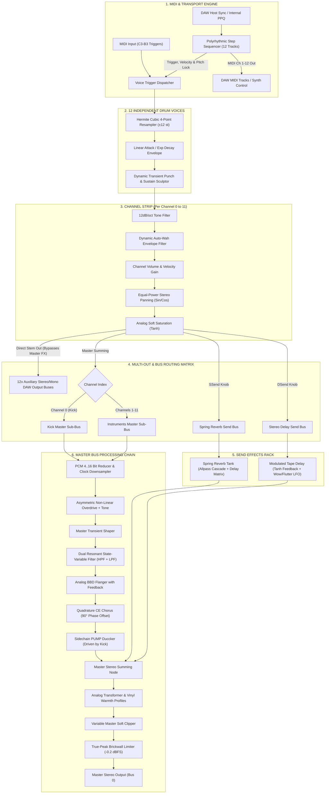

# 🔬 EXTASIS RHYTHM v3.0 — DETAILED SIGNAL & DSP ARCHITECTURE SPECIFICATION

This document provides a comprehensive technical breakdown of the audio signal flow, DSP processing blocks, threading topology, and MIDI routing engine inside **Extasis Rhythm**.

---

## 🗺️ High-Level Signal Flow Diagram



---

## 1. Voice Generation & Resampling Engine

Each of the 12 drum voices is triggered by either the internal polyrhythmic sequencer or incoming MIDI note events.

### A. Hermite Cubic 4-Point Interpolation
To achieve artifact-free pitch modulation ($\pm 12$ semitones) without the aliasing and high-frequency ringing of linear interpolation, Extasis Rhythm employs a continuous 4-point, 3rd-order Hermite polynomial:

$$y(x) = c_0 + x \cdot (c_1 + x \cdot (c_2 + x \cdot c_3))$$

Where $x = \text{frac}(\text{pos})$ and the coefficients are calculated from adjacent samples $y_0, y_1, y_2, y_3$:
- $c_0 = y_1$
- $c_1 = 0.5 \cdot (y_2 - y_0)$
- $c_2 = y_0 - 2.5 \cdot y_1 + 2.0 \cdot y_2 - 0.5 \cdot y_3$
- $c_3 = 0.5 \cdot (y_3 - y_0) + 1.5 \cdot (y_1 - y_2)$

### B. Envelope Shaping & Anti-Click Smoothing
- **Attack Phase**: Linear rise ramp calibrated from $0.5\text{ ms}$ to $50\text{ ms}$.
- **Decay Phase**: Pure exponential decay:
  $$\text{env}(t) = \exp\left(-\frac{t - t_{\text{att}}}{\tau_{\text{dec}}}\right)$$
- **Anti-Click Ramp**: A 3ms micro-fade window applied at playback start to eliminate waveform discontinuity clicks.

---

## 2. Channel Strip Architecture

Each voice processes its audio through an independent channel strip before hitting the bus summing matrix:

```
[Voice Sample] ➔ [Tone Filter (12dB)] ➔ [Auto-Wah Env Filter] ➔ [Vol & Velocity Gain] ➔ [Equal-Power Pan] ➔ [Tanh Saturation]
                                                                                                                │
                                          ┌─────────────────────────────────────────────────────────────────────┴───────────────┐
                                          ▼                                                                                     ▼
                            [Aux Output Bus (DAW Stem)]                                                               [Master Sum / Sends]
```

1. **Tone Filter**: State-Variable 12dB/oct low-pass / high-shelf tone control ($200\text{ Hz}$ to $15\text{ kHz}$).
2. **Dynamic Envelope Filter (`ENV`)**: An envelope follower modulating cutoff frequency in real time:
   $$f_c(t) = f_{\text{base}} \cdot (0.2 + 0.8 \cdot \text{env}(t))$$
3. **Equal-Power Stereo Panning**: Constant acoustic energy panning:
   $$L = \text{signal} \cdot \sqrt{0.5 \cdot (1 - \text{pan})}, \quad R = \text{signal} \cdot \sqrt{0.5 \cdot (1 + \text{pan})}$$
4. **Channel Soft Saturation**: Prevents digital inter-sample overs:
   $$y = \text{fastTanh}(x \cdot 1.5)$$

---

## 3. Multi-Out & Stem Routing Matrix

Extasis Rhythm features **13 Audio Output Buses**:

| Bus Index | Bus Name | Channel Set | Routing Description |
| :--- | :--- | :--- | :--- |
| **Bus 0** | **Master** | Stereo | Full summed mix through Master FX chain. |
| **Bus 1** | **Kick** | Stereo / Mono | Clean voice 1 output (bypasses Master FX). |
| **Bus 2** | **Snare** | Stereo / Mono | Clean voice 2 output (bypasses Master FX). |
| **Bus 3** | **Closed Hat** | Stereo / Mono | Clean voice 3 output (bypasses Master FX). |
| **Bus 4** | **Open Hat** | Stereo / Mono | Clean voice 4 output (bypasses Master FX). |
| **Bus 5** | **Clap** | Stereo / Mono | Clean voice 5 output (bypasses Master FX). |
| **Bus 6** | **Rimshot** | Stereo / Mono | Clean voice 6 output (bypasses Master FX). |
| **Bus 7** | **Hi Perc** | Stereo / Mono | Clean voice 7 output (bypasses Master FX). |
| **Bus 8** | **Mid Perc** | Stereo / Mono | Clean voice 8 output (bypasses Master FX). |
| **Bus 9** | **Low Perc** | Stereo / Mono | Clean voice 9 output (bypasses Master FX). |
| **Bus 10** | **Cowbell** | Stereo / Mono | Clean voice 10 output (bypasses Master FX). |
| **Bus 11** | **Crash** | Stereo / Mono | Clean voice 11 output (bypasses Master FX). |
| **Bus 12** | **Ride** | Stereo / Mono | Clean voice 12 output (bypasses Master FX). |

---

## 4. Send Effects Architecture

### A. Modulated Analog Tape Delay
- Delay buffer with sub-sample cubic interpolation.
- Low-frequency LFO modulating delay time ($\pm 20\text{ ms}$) simulating capstan wow & flutter.
- Tanh non-linear soft clipper in feedback path preventing run-away self-oscillation while warming echoes.

### B. Accutronics Spring Reverb Tank
- Series cascade of 4 dispersive all-pass filters creating dense reflection clusters.
- Low-pass damping filter inside the feedback matrix modeling physical spring attenuation.

---

## 5. Master Bus DSP Topology

```
[Kick + Other Sum] ➔ [PCM 4..16b & Downsampler] ➔ [Rat Drive] ➔ [Trans Shaper] ➔ [DJ HPF/LPF] ➔ [Flanger] ➔ [Chorus] ➔ [PUMP Duccker]
                                                                                                                            │
[+ Spring & Delay Returns] ◄────────────────────────────────────────────────────────────────────────────────────────────────┘
        │
        ▼
[Master Gain] ➔ [Analog / Vinyl Filters] ➔ [Variable Soft Clipper] ➔ [Ceiling Limiter (-0.2 dBFS)] ➔ [Output Bus 0]
```

1. **PCM Bit Crusher & Clock Downsampler**: Quantizes linear amplitude to $2^N$ discrete steps ($N \in [4, 16]$) and holds sample values across variable clock division ratios ($6.25\text{ kHz}$ to $100\text{ kHz}$).
2. **Overdrive**: Asymmetric wavefolder providing warm odd and even harmonic distortion.
3. **Dual DJ Filter**: 2nd-order State-Variable filters with independent resonance ($Q$) controls.
4. **PUMP Sidechain Duccker**: Uses the Kick envelope to duck the other drum voices, creating dynamic club pumping.
5. **Limiter & True-Peak Protection**: Brickwall safety limiter with lookahead to prevent inter-sample clipping on commercial streaming exports.

---

## 6. MIDI In / Out Routing Topology

### A. MIDI Input (Voice Triggers)
- **Primary Octave**: Chromatic C3 (60) to B3 (71).
- **Secondary Octaves**: C2 (48..59) and C1 (36..47).
- **General MIDI Fallback**: Handles standard GM drum pad layouts.

### B. 12-Channel MIDI Sequencer Output
- **Channel 1 to 12**: Each sequencer row maps 1:1 to MIDI channels 1 through 12.
- **Transmitted Data**: Note-On, Note-Off, Velocity ($0.4, 0.7, 1.0$), Step Transposition Semitones (*Note Lock*), and Portamento Glides.
- Enables direct control of hardware / virtual basslines (e.g. Roland TB-303).

---
*Extasis Rhythm Architecture Documentation — Extasis Records 2026.*


> **Licencias:** Consigue tu licencia oficial en [http://laurorobles.gumroad.com](http://laurorobles.gumroad.com)
