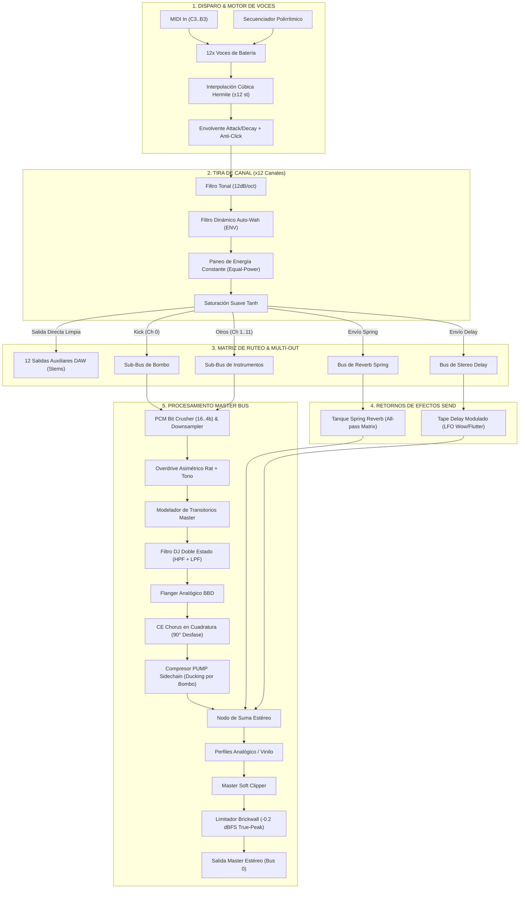

# 🎛️ EXTASIS RHYTHM v3.0 — MANUAL OFICIAL DE USUARIO Y REFERENCIA TÉCNICA

---

## 📖 ÍNDICE GENERAL
1. [Filosofía, Arquitectura e Inspiraciones](#1-filosofía-arquitectura-e-inspiraciones)
2. [Cabecera Superior & Gestión Global](#2-cabecera-superior--gestión-global)
3. [Módulo de Patrones (PATTERNS)](#3-módulo-de-patrones-patterns)
4. [Módulo de Fills (FILL SEQUENCER)](#4-módulo-de-fills-fill-sequencer)
5. [Tiras de Canales de Instrumento (12 Canales)](#5-tiras-de-canales-de-instrumento-12-canales)
6. [Secuenciador Polirrítmico Multitrack (32 Pasos & Modos)](#6-secuenciador-polirrítmico-multitrack-32-pasos--modos)
7. [Rack de Efectos & Procesamiento DSP](#7-rack-de-efectos--procesamiento-dsp)
8. [Módulo Master Bus, Monitoreo & VU Meter](#8-módulo-master-bus-monitoreo--vu-meter)
9. [Guía Rápida de Atajos y Tips de Producción](#9-guía-rápida-de-atajos-y-tips-de-producción)
10. [Modo Demo & Activación de Licencia](#10--modo-demo--activación-de-licencia)
11. [Entrada/Salida Multi-Canal en Ableton Live y DAWs](#11-️-entradasalida-multi-canal-en-ableton-live-y-daws)
12. [Arquitectura Detallada de la Señal & Flujo DSP](#12-🔬-arquitectura-detallada-de-la-señal--flujo-dsp)

---

## 1. FILOSOFÍA, ARQUITECTURA E INSPIRACIONES

**Extasis Rhythm v3.0** es una estación de trabajo de percusión y caja de ritmos híbrida diseñada en C++ / JUCE para ofrecer el flujo de trabajo táctil, rápido y contundente de las cajas de ritmo clásicas de hardware junto con la flexibilidad avanzada de los secuenciadores modernos polirrítmicos y un rack de efectos vintage integrado.

### 🏛️ Árbol de Inspiraciones:
* **Roland TR-808 / TR-909 / TR-8S**:
  * La inmediatez del secuenciador de pasos por pasos, sistema de velocidad multinivel (Ghost, Normal, Accent), LEDs de audición por canal y pista dedicada de *Fill-in*.
* **E-mu SP-1200 & Akai MPC60**:
  * El carácter crunch y la textura de la era dorada del hip-hop y electro. Resampleo con reducción de bits (12-bit / 8-bit), variabilidad de frecuencia de reloj PCM, filtros analógicos de corte de tono y algoritmos de interpolación cúbica *Hermite* para un pitch sin artefactos ásperos.
* **Elektron Octatrack / Machinedrum / Digitakt**:
  * Secuenciación polimétrica y polirrítmica desacoplada (longitudes independientes por pista de 1 a 32 pasos), modos de reproducción direccionales por carril (*Forward, Reverse, Random, Ping-Pong*), micro-desplazamiento de patrones (*Shift*) y modulación de afinación por paso (*Pitch Lock & Glide*).
* **Pedales Clásicos y Efectos de Estudio**:
  * **Boss CE-2 / Roland Juno-60**: Chorus analógico BBD estéreo en cuadratura (90° de desfase L/R).
  * **ProCo Rat**: Saturación y distorsión con curva asimétrica y filtro tonal.
  * **Roland RE-201 Space Echo**: Delay de cinta analógico con modulación LFO (*wow & flutter*) y saturación suave de saturador tanh en la retroalimentación.
  * **Tanque de Resortes Accutronics**: Reverb de resortes modelada mediante cascada de filtros all-pass y líneas de retardo dispersivas.
  * **SSL G-Master Bus Compressor**: Ducking dinámico tipo sidechain (*PUMP*) y limitador tipo brickwall analógico.

---

## 2. CABECERA SUPERIOR & GESTIÓN GLOBAL

Ubicada en la parte superior izquierda de la interfaz, gobierna el transporte global del motor y la carga de librerías.

### 🎛️ Controles:
* **`PLAY` (Verde)**: Inicia la reproducción del secuenciador interno. Cuando el plugin está alojado en un DAW con transporte activo, se sincroniza automáticamente al host mediante posición PPQ.
* **`STOP` (Rojo)**: Detiene el transporte inmediatamente y silencia las colas de reproducción.
* **`BPM` (Bar Slider)**: Ajusta el tempo interno de 20.0 a 300.0 BPM (con precisión decimal). Si el DAW está en reproducción, hereda el tempo maestro del proyecto.
* **`GLOBAL KIT SELECTOR` (Menú Desplegable)**: Carga una colección completa de 12 sonidos curados (kits vintage, cajas legendarias, acústicas, electrónicas, etc.) de la carpeta de muestras.
* **`📁` (Browse Samples Folder)**: Botón de explorador para seleccionar una carpeta personalizada de samples en cualquier disco duro. Por defecto busca en `Documentos/ExtasisRhythm_Samples`, pero recuerda tu carpeta personalizada de forma persistente.
* **`RANDOM` (Botón Naranja)**: Genera combinaciones aleatorias e inteligentes de muestras explorando carpetas y variantes para disparar la creatividad instantánea.
* **`SAVE` (Verde)**: Abre un explorador de archivos para guardar el estado completo del proyecto, kits, patrones, notas y efectos en un archivo `.xml` propietario.
* **`LOAD` (Naranja Oscuro)**: Carga presets y proyectos `.xml` previamente guardados.
* **`RESET` (Naranja)**: Restaura todos los parámetros de síntesis, mezcla y efectos a sus valores calibrados de fábrica sin borrar los patrones programados.
* **`SEQ RST` (Púrpura)**: Limpia por completo todas las secuencias de pasos, notas, glides y fills de los 8 patrones.

---

## 3. MÓDULO DE PATRONES (PATTERNS)

Gestiona la memoria de patrones musicales para estructurar canciones completas y variaciones rítmicas en vivo o en estudio.

* **Botones de Patrón (`A` a `H`)**: 8 patrones completos independientes. Cada uno almacena su propia secuencia de 32 pasos por canal, dinámicas (*velocities*), afinaciones por paso (*Note Locks*), *Glides* y carril de *Fill*.
* **`COPY >` (Copiar al Siguiente Patrón)**: Clona instantáneamente el patrón actualmente activo (todos los 12 canales, notas, glides y fills) al siguiente patrón (`A ➔ B`, `B ➔ C`, etc.) y conmuta automáticamente a él para continuar evolucionando el ritmo sin interrupciones.
* **Conmutación Fluida e Instantánea**: El cambio entre patrones ocurre al vuelo, manteniendo la fase del compás y refrescando de inmediato la visualización de la cuadrícula de pasos.
* **Memoria No Volátil**: Todos los 8 patrones se guardan automáticamente dentro de tus proyectos de DAW y al exportar con el botón **`SAVE`**.

---

## 4. MÓDULO DE FILLS (FILL SEQUENCER)

Ubicado entre el panel de patrones y el rack de efectos. Permite insertar redobles, variaciones y transiciones complejas globales.

* **Parrilla de 16 Pasos de Fill**: Cada paso cuenta con 3 estados (Apagado, Medio, Fuerte).
* **Smart Fill Memory (Estilo MPC / Pocket Operator)**: ¡Novedad en v3.0! Al desactivar un Fill, el secuenciador recuerda tu patrón original de manera inteligente, garantizando que el groove nunca caiga o se desfase al regresar a la programación principal.
* **`3L` (Triplet Fill)**: Conmuta la métrica del Fill a tresillos de 12 pasos.
* **`FIT` (Fit Fill)**: Comprime o expande la secuencia de fill uniformemente dentro del compás.
* **`MODE` (FWD / REV / RND / PNB)**: Determina la dirección de lectura del fill.
* **`-` / `+` & Display de Longitud**: Define la cantidad de pasos activos del fill (1 a 16).
* **`<<` / `>>` (Shift Fill)**: Rota los pasos del fill hacia la izquierda o derecha.

---

## 5. TIRAS DE CANALES DE INSTRUMENTO (12 CANALES)

Extasis Rhythm cuenta con 12 tiras de canal idénticas y dedicadas para cada voz:
1. **KICK** | 2. **SNARE** | 3. **CLOSED HAT** | 4. **OPEN HAT** | 5. **CLAP** | 6. **RIMSHOT** | 7. **HI PERC** | 8. **MID PERC** | 9. **LOW PERC** | 10. **COWBELL** | 11. **CRASH** | 12. **RIDE**

### 🔘 Botones Superiores de Canal:
* **LED de Audición (Botón circular interactivo)**:
  * Parpadea con luz azul brillante cuando el canal es disparado por el secuenciador o MIDI.
  * **Al hacer clic sobre él**: Dispara manualmente el sample del canal con velocidad completa (función de preescucha).
* **`M` (Mute)**: Silencia la señal de audio del canal de manera instantánea y libre de clics.
* **`S` (Solo)**: Aísla el canal, silenciando todos los demás tracks que no tengan solo activo.
* **`ENV` (Env Filter Send)**: Activa el ruteo del canal hacia el filtro de envolvente dinámico (*Envelope Follower*).
* **Selector de Kit (Menú superior)**: Permite asignar a ese canal una muestra proveniente de un kit distinto al global (mezcla híbrida de kits).
* **Selector de Variante (Menú inferior)**: Permite elegir entre diferentes tomas, capas o articulaciones del instrumento dentro del kit asignado.

### 🎚️ Perillas de Canal (8 Knobs):
1. **`VOL` (Volumen)**: Nivel de salida individual del canal antes de la mezcla maestra.
2. **`PAN` (Panorama)**: Posición espacial estéreo (L 100% a R 100%) con compensación de energía *constant-power*.
3. **`PITCH` (Afinación)**: Transposición de tono en un rango de ±24 semitonos (4 octavas completas). Utiliza interpolación cúbica Hermite de 4 puntos para mantener la pegada de transitorios sin artefactos metálicos.
4. **`TONE` (Tono / Filtro LP)**: Filtro pasa-bajas individual (de 20 Hz a 20 kHz) para oscurecer o abrillantar el instrumento antes de los buses de efectos.
5. **`ATT` (Ataque)**: Tiempo de subida de la envolvente de amplitud (0.5 ms a 50 ms). Permite suavizar el golpe del transitorio o crear efectos tipo *swell/reverse*.
6. **`DEC` (Decaimiento)**: Curva exponencial de caída (20 ms a 3.0 s). Ideal para acortar colas de timbales/címbalos o extender el sustain de un bombo 808.
7. **`S.SEND` (Spring Send)**: Cantidad de señal enviada al procesador de reverberación de resortes.
8. **`D.SEND` (Delay Send)**: Cantidad de señal enviada a la línea de retardo estéreo.

---

## 6. SECUENCIADOR POLIRRÍTMICO MULTITRACK (32 PASOS & MODOS)

Ubicado en la mitad inferior de la interfaz. Cada uno de los 12 canales posee su propio motor de secuenciación independiente.

### 🎛️ Controles por Carril:
* **Etiqueta del Canal**: Identificador visual del instrumento con tipografía amplia y sin solapamiento (ej. `CLOSED HAT`, `RIMSHOT`, `HI PERC`).
* **`FIX` / `FIT` (Modo de Rejilla)**:
  * **`FIX` (Fixed Time Grid)**: Los pasos tienen una duración estándar fija de semicorchea (1/16).
  * **`FIT` (Polyrhythmic Metric Scaling)**: Escala y comprime la cantidad de pasos seleccionada (hasta 32 pasos) para que quepan exactamente en la duración de un compás de 4/4. Esto permite generar polirritmias reales (ej. 5 contra 4, 7 contra 4, 11 contra 16) sincronizadas al compás maestro.
* **`MODE` (Modos de Reproducción)**:
  * **`FWD` (Forward)**: Reproducción lineal tradicional (0 → 1 → 2 → 3...).
  * **`REV` (Reverse)**: Reproducción en reversa hacia atrás (15 → 14 → 13... o `N-1` a 0).
  * **`RND` (Random)**: Selección aleatoria de paso en cada pulso de reloj (patrones generativos / no repetitivos).
  * **`PNB` (Ping-Pong)**: Modo péndulo de ida y vuelta (0 → 1 → 2 → 3 → 2 → 1 → 0...).
* **`-` / `+` & Display de Longitud**: Configura la longitud métrica activa del canal (de 1 a 32 pasos).
* **`<` / `>` (Track Shift / Rotación de Pasos)**: Rota todos los pasos, notas y glides del carril hacia la izquierda o derecha en tiempo real.
* **Botones de Pasos**:
  * **Clic Izquierdo Cíclico**:
    * *Nivel 1 (Naranja / Acento)*: Acento / Velocidad máxima (`1.0`).
    * *Nivel 2 (Amarillo)*: Velocidad media (`0.7`).
    * *Nivel 3 (Amarillo Suave)*: Ghost Note / Velocidad baja (`0.4`).
    * *Nivel 4 (Gris)*: Paso apagado (`0.0`).
  * **Clic Derecho / Note Pitch Lock & Glide**:
    * Permite fijar afinaciones melódicas por paso y activar ligaduras de portamento (*Glide*, representado con una barra diagonal azul cian).
* **Cursor de Transporte Activo**:
  * Indicador rectangular azul semitransparente con borde brillante que recorre la rejilla en tiempo real indicando la posición exacta de lectura.

---

## 7. RACK DE EFECTOS & PROCESAMIENTO DSP

El rack superior derecho procesa las señales de batería mediante una cadena modular de alta gama:

### 1. 🎛️ FILTER (Filtro Maestro DJ / Dual State-Variable)
* **`HPF`**: Frecuencia de corte Pasa-Altas (20 Hz a 2 kHz).
* **`H.RES`**: Resonancia / Factor Q del filtro Pasa-Altas.
* **`LPF`**: Frecuencia de corte Pasa-Bajas (500 Hz a 20 kHz).
* **`L.RES`**: Resonancia del filtro Pasa-Bajas.

### 2. 🎛️ PCM (Emulador de Sampler Vintage E-mu SP-1200 / Akai MPC60)
* **`BITS`**: Reducción de resolución de 16-bit a 4-bit para textura analógica/digital granulada.
* **`RATE`**: Frecuencia de muestreo del reloj PCM (6.25 kHz a 100 kHz). Introduce armónicos de aliasing musical al bajarlo.

### 3. 🎛️ OVERDRIVE (Saturación & Distorsión ProCo Rat Style)
* **`DIST`**: Ganancia de saturación no lineal con función hiperbólica `tanh`.
* **`FLTR`**: Filtro de post-distorsión para recortar estridencias agudas.
* **`VOL`**: Compensación de ganancia de salida del módulo de distorsión.

### 4. 🎛️ TRANS (Modelador de Transitorios / Transient Shaper)
* **`ATT`**: Realza (+dB) o suaviza (-dB) el ataque inicial de los golpes.
* **`SUS`**: Aumenta el sustain y la resonancia del cuerpo del sonido o crea un efecto tipo compuerta (*gate*).

### 5. 🎛️ ENV FILTER (Filtro de Envolvente Dinámico / Auto-Wah)
* **`CUT`**: Frecuencia base de apertura.
* **`RES`**: Resonancia y pico vocal de barrido.
* *Nota*: Solo afecta a los canales que tengan encendido el botón `ENV`.

### 6. 🎛️ PUMP (Compresor Sidechain / Bus Ducker)
* **`ON/OFF`**: Activa/desactiva el bombeo rítmico.
* **`THR`**: Umbral de detección (-60 dB a 0 dB).
* **`AMT`**: Profundidad de reducción de ganancia (efecto *French House* o bombeo EDM).

### 7. 🎛️ FLANGER (Flanger Analógico BBD)
* **`ON/OFF`**: Enciende o apaga el flanger.
* **`RATE`**: Velocidad del oscilador LFO (0.1 Hz a 10 Hz).
* **`FB`**: Retroalimentación positiva o negativa (-90% a +90%) para efectos resonantes espaciales.

### 8. 🎛️ CE CHORUS (Chorus Estéreo Roland Juno / Boss CE-2 Style)
* **`ON/OFF`**: Activa el chorus con mezcla 50/50 Dry/Modulated clásica.
* **`RATE`**: Frecuencia del LFO de modulación (0.1 Hz a 10 Hz).
* **`DEPTH`**: Excursión y profundidad de retardo. Utiliza osciladores en cuadratura (90° de desfase estéreo) e interpolación continua para un ensanchamiento estéreo 3D cristalino y libre de clics.

### 9. 🎛️ DELAY (Delay de Cinta Modulado / Tape Echo)
* **`SYNC`**: Conmuta entre sincronización rítmica por divisiones de compás (1/16, 1/8T, 1/8, 1/8D, 1/4) y tiempo libre en milisegundos.
* **`TIME`**: Tiempo de retardo (10 ms a 1125 ms).
* **`FB`**: Retroalimentación con saturación analógica suave (*soft-clipping*).
* **`MOD`**: Modulación LFO sobre el cabezal de cinta (*Wow & Flutter* analógico).

### 10. 🎛️ SPRING (Reverberación de Tanque de Resortes)
* **`DEC`**: Tiempo de decaimiento y persistencia de las reflexiones en los resortes.
* **`TONE`**: Control de brillo y absorción de agudos del tanque.

---

## 8. MÓDULO MASTER BUS, MONITOREO & VU METER

El centro de control maestro y salida final:

### 🎛️ Controles:
* **`VOL` (Master Volume)**: Control de volumen general de la mezcla.
* **`CLIP` (Master Tape Clipper)**: Limitador de saturación suave para pegar la batería y aportar pegada sin distorsión digital áspera.
* **Selectores de Carácter PCM (`16B`, `12B`, `8B`)**: Modos rápidos de conversión de bits estilo SP-1200 / MPC60.
* **Botones de Color Analógico**:
  * **`ANLG`**: Emulación de transformador y saturación de consola analógica.
  * **`VNYL`**: Perfil de vinilo (corte subsónico y calidez en altas frecuencias).
  * **`PUMP`**: Asigna el sidechain del módulo PUMP al bus maestro.
  * **`ANTI`**: Filtro de reconstrucción y suavizado anti-aliasing.
  * **`LIMIT`**: Limitador brickwall con techo de seguridad a -0.2 dBFS para prevenir *clipping* digital en el bus maestro.
* **Medidor de Carga de CPU**: Monitor numérico en tiempo real (`CPU: X.X%`) centrado debajo del botón `LIMIT`.
* **Vúmetro Estéreo LED**: Doble barra de 14 segmentos con balística calibrada en decibeles:
  * Verde (-48 dB a -12 dB)
  * Ámbar (-12 dB a -3 dB)
  * Rojo (-3 dB a +3 dB)

---

## 9. GUÍA RÁPIDA DE ATAJOS Y TIPS DE PRODUCCIÓN

1. **Crear Polirritmias Complejas (Ej. 7/8 sobre 4/4)**:
   - En el canal deseado (ej. HI PERC), activa el botón **`FIT`**.
   - Ajusta la longitud a **7 pasos**.
   - Los 7 golpes se repartirán proporcionalmente a lo largo del compás de 4/4 sin perder el inicio del compás.
2. **Generar Hi-Hats Orgánicos no repetitivos**:
   - Ajusta el carril de CLOSED HAT en modo **`RND`** o **`PNB`** con longitud de 11 o 13 pasos.
   - Modula ligeramente el knob de `ATT` y `TONE` para dar variación dinámica constante.
3. **Lograr el sonido Hip-Hop clásico Golden Era de 12 bits**:
   - Activa el botón **`12B`** en el Master Bus.
   - Sube ligeramente el knob **`PITCH`** de los instrumentos y luego afínalos hacia abajo en el canal para obtener el característico grano crujiente del SP-1200.
4. **Guardar y Cargar Presets Completos (`SAVE` / `LOAD`)**:
   - Haz clic en **`SAVE`** para guardar tu kit, mezclas y patrones en la carpeta dedicada `Documents/ExtasisRhythm_Presets/` en formato `.xml`.
   - **Qué almacena un Preset**:
     * Selección de kits y samples personalizados de cada uno de los 12 canales.
     * Los 8 patrones de ritmo completos (A a H) con sus velocidades, afinaciones por paso (*Note Locks*), *Glides* y carril de *Fill*.
     * Modos de reproducción del secuenciador (`FWD`, `REV`, `RND`, `PNB`) y longitudes (`FIT`).
     * Todos los knobs de los canales (Volumen, Paneo, Tono, Envolvente, Spring, Delay) y la configuración del Master Bus.
   - Haz clic en **`LOAD`** para cargar cualquier preset guardado; la interfaz y el motor sonoro se sincronizan automáticamente al instante.
5. **Empaquetado y Distribución de Releases**:
   - Para generar un paquete instalador completo para macOS con un solo clic, ejecuta en la terminal `./create_release_zip_macos.sh`. El archivo resultante `dist/ExtasisRhythm-macOS.zip` contiene el plugin VST3, la aplicación Standalone, la librería completa de samples, el manual y el instalador automático.
   - En GitHub Actions, cada actualización genera automáticamente los instaladores para Windows y macOS listos para descargar.

## 10. 🔑 MODO DEMO & ACTIVACIÓN DE LICENCIA

Extasis Rhythm cuenta con un sistema de verificación criptográfica offline y evaluación demo:
* **Modo Demo (Evaluación de 10 minutos)**:
  - Si el plugin no ha sido activado con una licencia, permite una evaluación completa del motor sonoro y secuenciador durante **10 minutos continuos**.
  - Al cumplirse los 10 minutos, la salida de audio se silencia automáticamente y se despliega la ventana de activación requiriendo el serial de compra para continuar.
* **Activación de Licencia Permanente**:
  1. Al iniciar el plugin por primera vez, o al expirar la demo, haz clic en el botón naranja **`ACTIVATE`** (o en la ventana modal).
  2. Pega tu clave oficial de 16 caracteres (formato: `EXTR-XXXX-XXXX-XXXX-XXXX`).
  3. Haz clic en **`ACTIVATE LICENSE`**.
  4. Una vez activado, el diálogo y el botón de activación desaparecen por completo, y el plugin queda permanentemente desbloqueado de por vida en tu estación de trabajo.

---

## 11. 🎛️ ENTRADA/SALIDA MULTI-CANAL EN ABLETON LIVE Y DAWS

### A. Ruteo Multi-Output de Audio (13 Salidas Estéreo)
Extasis Rhythm cuenta con un bus principal estéreo (**Master Bus**) y **12 buses auxiliares estéreo dedicados** (uno por cada voz de batería).
* **Cómo rutear stems individuales en Ableton Live**:
  1. Inserta `ExtasisRhythm` en una pista MIDI.
  2. Crea una nueva pista de **Audio** en Ableton.
  3. En la sección *Audio From* (Entrada de Audio), selecciona **ExtasisRhythm**.
  4. En el segundo menú desplegable, selecciona el canal que deseas separar: `Kick`, `Snare`, `Closed Hat`, `Open Hat`, `Clap`, `Rimshot`, `Hi Perc`, `Mid Perc`, `Low Perc`, `Cowbell`, `Crash` o `Ride`.
  5. Activa el monitor en **`In`**.
  > [!NOTE]
  > Las salidas individuales envían la señal limpia procesada por los knobs de canal (Volumen, Paneo, Tono, Envolvente), permitiéndote mezclar y procesar cada instrumento con tus propios plugins de mezcla en Ableton sin pasar por los efectos maestros.

---

### B. Mapeo MIDI Cromático (C3 a B3) y Disparo de Canales
Puedes disparar y grabar las 12 voces de Extasis Rhythm desde cualquier controlador MIDI, teclado, MPC, Launchpad o Ableton Push:

| Canal | Instrumento | Nota MIDI Primaria (C3) | Número de Nota | Octava C2 | Octava C1 |
| :--- | :--- | :--- | :--- | :--- | :--- |
| **Ch 1** | **KICK** | **`C3`** | **60** | 48 (`C2`) | 36 (`C1`) |
| **Ch 2** | **SNARE** | **`C#3`** | **61** | 49 (`C#2`) | 37 (`C#1`) |
| **Ch 3** | **CLOSED HAT** | **`D3`** | **62** | 50 (`D2`) | 38 (`D1`) |
| **Ch 4** | **OPEN HAT** | **`D#3`** | **63** | 51 (`D#2`) | 39 (`D#1`) |
| **Ch 5** | **CLAP** | **`E3`** | **64** | 52 (`E2`) | 40 (`E1`) |
| **Ch 6** | **RIMSHOT** | **`F3`** | **65** | 53 (`F2`) | 41 (`F1`) |
| **Ch 7** | **HI PERC** | **`F#3`** | **66** | 54 (`F#2`) | 42 (`F#1`) |
| **Ch 8** | **MID PERC** | **`G3`** | **67** | 55 (`G2`) | 43 (`G1`) |
| **Ch 9** | **LOW PERC** | **`G#3`** | **68** | 56 (`G#2`) | 44 (`G#1`) |
| **Ch 10** | **COWBELL** | **`A3`** | **69** | 57 (`A2`) | 45 (`A1`) |
| **Ch 11** | **CRASH** | **`A#3`** | **70** | 58 (`A#2`) | 46 (`A#1`) |
| **Ch 12** | **RIDE** | **`B3`** | **71** | 59 (`B2`) | 47 (`B1`) |

---

### C. Salida MIDI de 12 Canales (Controlar Sintes Externos / TB-303)
El secuenciador interno de Extasis Rhythm emite notas MIDI en tiempo real hacia tu DAW:
* Cada carril del secuenciador (1 al 12) transmite en su propio canal MIDI (**Canal 1 al Canal 12**).
* **Cómo controlar un sintetizador (ej. Roland TB-303, Phoscyon, ABL3 o sinte de Ableton)**:
  1. En una pista MIDI en Ableton, carga tu sintetizador de bajo o melodía (ej. TB-303).
  2. En el menú *MIDI From* de esa pista, selecciona **ExtasisRhythm**.
  3. En el submenú de canal, selecciona el canal MIDI correspondiente (ej. **Ch. 1** para el carril de Kick o **Ch. 7** para Hi Perc).
  4. Activa el monitor en **`In`**.
  5. Al reproducir, las notas, afinaciones por paso (Note Lock) y secuencias polirrítmicas (`FIT`) de ese carril tocarán tu sintetizador automáticamente.

---

## 12. 🔬 ARQUITECTURA DETALLADA DE LA SEÑAL & FLUJO DSP

Para una especificación técnica profunda en código y matemáticas, consulta también [ARCHITECTURE.md](ARCHITECTURE.md).

### A. Diagrama de Bloques y Ruteo de Señal

### B. Etapas de Procesamiento Explicadas

1. **Interpolación Cúbica Hermite de 4 Puntos**:
   - Evita la aspereza digital y el aliasing al transponer muestras mediante el polinomio de Hermite de 3er orden:
     $$y(x) = c_0 + x \cdot (c_1 + x \cdot (c_2 + x \cdot c_3))$$
2. **Tira de Canal**:
   - Cada canal posee su propio filtro de tono SVF, seguidor de envolvente auto-wah, paneo estéreo de energía constante ($\sin / \cos$) y saturador suave $\tanh$.
3. **Multi-Out Stems**:
   - Las 12 salidas auxiliares toman la señal directamente después de la tira de canal, permitiendo mezclar y ecualizar cada instrumento de forma aislada en tu DAW sin pasar por los efectos maestros.
4. **Efectos Send en Paralelo**:
   - Los buses de **Spring Reverb** (cascada de 4 etapas all-pass) y **Tape Delay** (con modulación LFO analógica) procesan en paralelo y retornan directamente al nodo de suma master.
5. **Cadena Master Analógica y Digital**:
   - Los instrumentos pasan por reducción de bits PCM, overdrive armónico, modelado de transitorios, filtros DJ resonantes, modulación estéreo BBD (Flanger/Chorus) y sidechain PUMP antes del limitador de seguridad True-Peak.

---
*Extasis Rhythm v3.0 — Diseñado para la creación rítmica sin límites.*

> **Licencias:** Consigue tu licencia oficial en [http://laurorobles.gumroad.com](http://laurorobles.gumroad.com)
