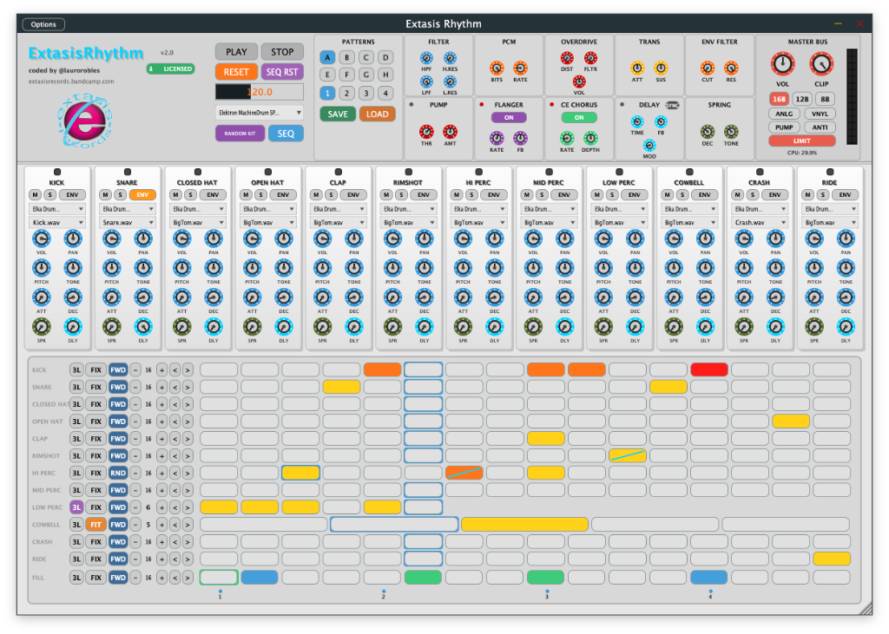

# 🥁 Extasis Rhythm (v2.0)

<p align="center">
  
</p>

<p align="center">
  <strong>Hybrid Vintage Drum Machine, Multi-Out Workstation & 12-Channel Polyrhythmic Groovebox</strong><br>
  <em>Built with JUCE 7 (C++20) for macOS (Universal Binary) & Windows (x64).</em>
</p>

<p align="center">
  
  
  
  
</p>

---

<p align="center">
  
</p>

---

## ✨ Overview

**Extasis Rhythm** combines the raw, tactile grit of legendary 80s/90s hardware beatboxes (*Roland TR-808/TR-909, E-mu SP-1200, Akai MPC60, LinnDrum*) with modern polymetric sequencing (*Elektron Octatrack/Digitakt*), multi-output DAW routing, and a dedicated vintage analog/digital multi-FX rack.

---

### 🌟 Key Highlights

* **12 Independent Drum Voices**:
  - `Kick`, `Snare`, `Closed Hat`, `Open Hat`, `Clap`, `Rimshot`, `Hi Perc`, `Mid Perc`, `Low Perc`, `Cowbell`, `Crash`, `Ride`.
* **Multi-Output Audio Routing (13 Stereo Buses)**:
  - **Master Bus**: Summed mix processed through the master analog/digital effect chain.
  - **12 Dedicated Stem Buses**: Route dry/panned individual instruments directly to separate audio tracks in **Ableton Live**, **Logic Pro**, **FL Studio**, **Cubase**, or **Reaper** for dedicated mixing and external VST processing.
* **12-Channel MIDI Sequencer Output**:
  - Every sequencer track outputs on its own MIDI channel (**MIDI Channels 1 to 12**).
  - Emits note triggers, velocities, and per-step semitone pitch locks (*Note Locks*) with portamento *Glides* to drive external synthesizers (e.g. Roland TB-303, basslines, or software instruments).
* **Chromatic MIDI Pad & Controller Mapping**:
  - Chromatically mapped starting at **C3 (Note 60)**:
    `Kick: C3 (60)`, `Snare: C#3 (61)`, `Closed Hat: D3 (62)`, `Open Hat: D#3 (63)`, `Clap: E3 (64)`, `Rimshot: F3 (65)`, `Hi Perc: F#3 (66)`, `Mid Perc: G3 (67)`, `Low Perc: G#3 (68)`, `Cowbell: A3 (69)`, `Crash: A#3 (70)`, `Ride: B3 (71)`.
    *(Includes octaves C2 and C1 as fallbacks for any MIDI controller).*
* **Complete Preset Management (`SAVE` / `LOAD`)**:
  - 1-click preset saving and loading stored in `~/Documents/ExtasisRhythm_Presets/`.
  - Preserves all 12 sample kit selections, 8 pattern sequences (A to H), note locks, glides, fill tracks, channel knob settings, and Master FX parameters.
* **Hermite Cubic Resampling Engine**:
  - 4-point continuous polynomial interpolation for clean, artifact-free pitch transposition ($\pm 12$ semitones).
* **Polyrhythmic Step Sequencer**:
  - Independent track lengths (1 to 32 steps) across all 12 channels.
  - **8 Independent Patterns (A to H)** with instant smooth switching.
  - **`COPY >` (Copy to Next Pattern)**: 1-click clone and evolve workflow.
  - Metric scaling modes: **`FIX`** (standard 16th grid) and **`FIT`** (polyrhythmic metric compression over 4/4 bars).
  - Playback directions per channel: **`FWD`** (Forward), **`REV`** (Reverse), **`RND`** (Random generative), **`PNB`** (Ping-Pong / Pendulum).
  - 3 dynamic velocity levels per step, pitch transposition locks, and portamento **`Glide`**.
  - **Dedicated 16-Step Fill Engine**: Immediate transitions and roll injection on the fly.
* **Vintage Multi-FX Rack**:
  - **Filter**: Dual resonant State-Variable DJ Filter (HPF / LPF).
  - **PCM Crunch**: Variable bit depth (16 to 4-bit) & clock downsampling (6.25 to 100 kHz).
  - **Overdrive**: Asymmetric non-linear soft saturation with tone filter.
  - **Transient Shaper**: Attack punch and sustain sculpting.
  - **Dynamic Envelope Filter**: Auto-Wah follower with vocal resonance.
  - **Pump Compressor**: Sidechain bus ducker.
  - **Analog Flanger & Stereo CE Chorus**: Quadrature LFO modulation with zero click artifacts.
  - **Modulated Tape Delay & Spring Reverb Tank**: Analog-modeled allpass network with soft-clipping.
  - **Master Bus & Metering**: Brickwall ceiling limiter (-0.2 dBFS), Tape soft clipper, Vinyl simulator, real-time CPU monitor, and 14-segment stereo LED ladder.

---

## ⚡ 1-Click Automated Installation

Each release package includes automated 1-click installers that configure the VST3 plugin, standalone app, and factory sample library in seconds:

* **🍏 macOS (`INSTALL_MAC.command`)**:
  - Automatically installs VST3 to `~/Library/Audio/Plug-Ins/VST3/ExtasisRhythm.vst3`
  - Installs Standalone app to `/Applications/ExtasisRhythm.app`
  - Copies sample library to `~/Documents/ExtasisRhythm_Samples/`
* **🪟 Windows (`INSTALL_WINDOWS.bat`)**:
  - Automatically installs VST3 to `C:\Program Files\Common Files\VST3\ExtasisRhythm.vst3`
  - Copies sample library to `%USERPROFILE%\Documents\ExtasisRhythm_Samples\`

---

## 📖 Official User Manual & Technical Architecture

* **[Official User Manual (MANUAL.md)](MANUAL.md)**: In-depth user guide, parameter reference, DAW setup, and production techniques.
* **[Signal & DSP Architecture Specification (ARCHITECTURE.md)](ARCHITECTURE.md)**: Detailed audio and MIDI signal flow diagrams, Hermite interpolation math, and multi-bus routing matrices.

---

## 📥 Download Pre-Compiled Binaries

- **Releases & Builds**: Download from the **[GitHub Releases](https://github.com/laurorobles/ExtasisRhythm/releases)** or **[GitHub Actions Artifacts](https://github.com/laurorobles/ExtasisRhythm/actions)** tab.
- **Official Store & Sound Packs**: [extasisrecords.bandcamp.com](https://extasisrecords.bandcamp.com)

---

## 🛠️ Building from Source

### Prerequisites:
- **CMake 3.22+**
- **C++20 Compiler**: Xcode Clang (macOS) or Visual Studio 2022 / MSVC (Windows)
- **Ninja** (optional, recommended for fast builds)

### Build Instructions:

```bash
# 1. Clone the repository
git clone --recursive https://github.com/laurorobles/ExtasisRhythm.git
cd ExtasisRhythm

# 2. Configure with CMake
cmake -B build -DCMAKE_BUILD_TYPE=Release

# 3. Build VST3 and Standalone targets
cmake --build build --config Release --parallel
```

Compiled binaries will be generated in:
- macOS: `build/ExtasisRhythm_artefacts/VST3/ExtasisRhythm.vst3` & `Standalone/ExtasisRhythm.app`
- Windows: `build/ExtasisRhythm_artefacts/VST3/ExtasisRhythm.vst3` & `Standalone/ExtasisRhythm.exe`

---

## 🔑 Demo Mode & License Activation

* **10-Minute Full Evaluation**:
  - If unregistered, the plugin operates in Demo Mode for 10 minutes with full access to all sound engines, sequencer tracks, and effects.
  - After 10 minutes, audio output is automatically muted and an activation dialog appears.
* **Instant Activation**:
  - Click **`ACTIVATE`**, enter your 16-character license key (`EXTR-XXXX-XXXX-XXXX-XXXX`), and click **`ACTIVATE LICENSE`** to unlock the plugin permanently and offline on your computer.

---

## 👥 Credits & Contact

- **DSP Architecture & Development**: Lauro Robles
- **Label & Releases**: [Extasis Records](https://extasisrecords.bandcamp.com)


> **Licencias:** Consigue tu licencia oficial en [http://laurorobles.gumroad.com](http://laurorobles.gumroad.com)
